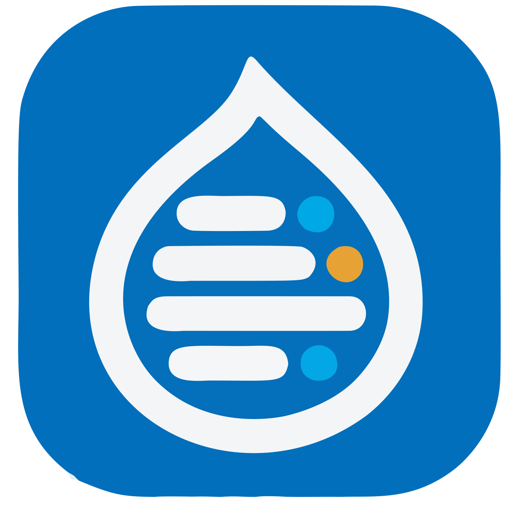

<h1 align="center">

</h1>

# Drupal Issue Hub

A Tauri 2 desktop app (macOS/Windows/Linux) that keeps track of issues across
a list of Drupal.org projects. It unifies the two places where Drupal issues
live:

- **drupal.org issue queues** — e.g. `https://www.drupal.org/project/issues/paragraphs`
  (read-only, via the `drupal.org/api-d7` JSON API)
- **git.drupalcode.org work items** — e.g. `https://git.drupalcode.org/project/tmgmt_deepl/-/work_items`
  (read + write, via the GitLab REST API)

## Features

- **Follow projects** by pasting a URL (or machine name) — drupal.org and
  git.drupalcode.org URLs are auto-detected, and drupal.org projects can be
  found by title via the search button in the add dialog.
- **Automatic source migration**: if a drupal.org project's queue is empty but
  the same machine name on git.drupalcode.org has work items (i.e. the issues
  were migrated to GitLab), the project is converted to a GitLab source
  automatically on its next refresh.
- **Unified issue list** with search, status and category filters, hideable
  columns (Columns ▾ in the toolbar), a "New & changed only" view, and
  comment counts. `NEW` marks issues that appeared since the last refresh,
  `UPD` marks issues whose last-change timestamp moved.
- **Favorites**: star issues in the list or the detail panel; the sidebar has
  a ★ Favorites view with a count. Stars survive refreshes.
- **Project management**: rename (✎), delete (✕) and drag-and-drop reorder
  projects in the sidebar; the order persists.
- **Issue detail panel** (resizable, width persisted):
  - rendered bodies — sanitized HTML for drupal.org, markdown/mixed content
    for GitLab (task lists and lists render correctly even when mixed with
    HTML headings); outbound links open in the system browser;
  - **Patches & MRs** section — patch files attached to a drupal.org issue
    and merge requests referenced by a GitLab issue's description/comments;
  - **discussion thread** — comments load on open, newest first by default
    (toggleable), with NEW badges and search; **edits are picked up**: the
    issue itself and its newest comments are re-checked on every open, and
    GitLab comments are re-fetched in full;
  - **write support on GitLab** (requires a personal access token in
    Settings): post comments, edit title/description, close/reopen.
    drupal.org queues have no write API and stay read-only.
- **Background refresh** (configurable interval, default 15 min) with desktop
  notifications summarizing new/changed issues per project.

State is stored in SQLite under the app data dir
(`~/Library/Application Support/com.steffen.drupal-issue-hub/issues.db`);
the GitLab token lives in the macOS Keychain.

## Development

```sh
npm install
npm run tauri dev      # run in dev mode
npm run tauri build    # produce the release bundle
cargo test --release --lib --manifest-path src-tauri/Cargo.toml
```

The release bundle lands in `src-tauri/target/release/bundle/`
(`macos/*.app`, `dmg/*.dmg`, plus NSIS/MSI/deb/AppImage/rpm on the
respective platforms).

Regenerate the app icons from `logo.svg` (already square-padded in
`src/assets/logo.svg`) with `npm run tauri icon src/assets/logo.svg`.

## Release workflow

Same model as whats-on-zwift:

- **`.github/workflows/build-app.yml`** — triggered by a `v*` tag (builds all
  four targets and publishes a GitHub release with generated notes) or by
  `workflow_dispatch` (build-only, artifacts attached to the run).
- **`.github/workflows/release.yml`** — one-click release: bump
  patch/minor/major, sync the version everywhere via
  `scripts/sync-version.mjs`, commit `chore(release): X`, tag and push.
- Requires a repository secret **`RELEASE_PAT`** (PAT with Contents:
  read/write) — `GITHUB_TOKEN`-pushed tags do not trigger other workflows.

## Architecture

```
src/                      React + TypeScript frontend
  api.ts                  typed wrappers around the Tauri commands
  render.ts               safe rendering: marked (markdown) + DOMPurify,
                          with the HTML-block fix for mixed GitLab content
  App.tsx                 state orchestration, polling, notifications
  components/
    Sidebar.tsx           project list: select, rename, delete, reorder,
                          favorites view
    IssueTable.tsx        issue list: search, filters, column picker,
                          favorites stars
    IssueDetail.tsx       detail panel: resize, body rendering, patches/MRs,
                          comment thread (search/sort), write actions
    AddProjectModal.tsx   add by URL/machine name + d.o search
    SettingsModal.tsx     polling interval, GitLab token management
src-tauri/
  src/drupal.rs           drupal.org api-d7 client: project lookup, issue
                          list, comments by cid, patch/MR page scraping
  src/gitlab.rs           GitLab client: issues, notes, edits, token check
  src/net.rs              send_retry: one retry on transport failures
  src/db.rs               SQLite schema + migrations + queries
  src/commands.rs         Tauri command surface used by the frontend
```

### Notes for maintainers

- Only `https://` URLs on `www.drupal.org` / `drupal.org` /
  `git.drupalcode.org` are accepted; every outgoing request validates its
  target host at the point of use (SSRF guard in `drupal.rs`).
- Issue status codes from the drupal.org API are mapped to their labels
  (1=Active, 8=Needs review, 13=Needs work, 14=RTBC, …); GitLab issue
  metadata comes from the `Status: …` / `Category: …` / `Version: …` labels
  that drupal.org's GitLab integration sets.
- drupal.org quirks: the issue list parameter is `limit` (not `pagesize`),
  the file entity API is closed (403), so patches are scraped from the
  rendered issue page; comments are fetched one-by-one by `cid`, incrementally
  (only uncached ones, capped per open).
- git.drupalcode.org quirks: the notes API requires authentication even for
  public projects, and its related-MR endpoints do not exist — MRs are
  extracted from description/comment text instead.
